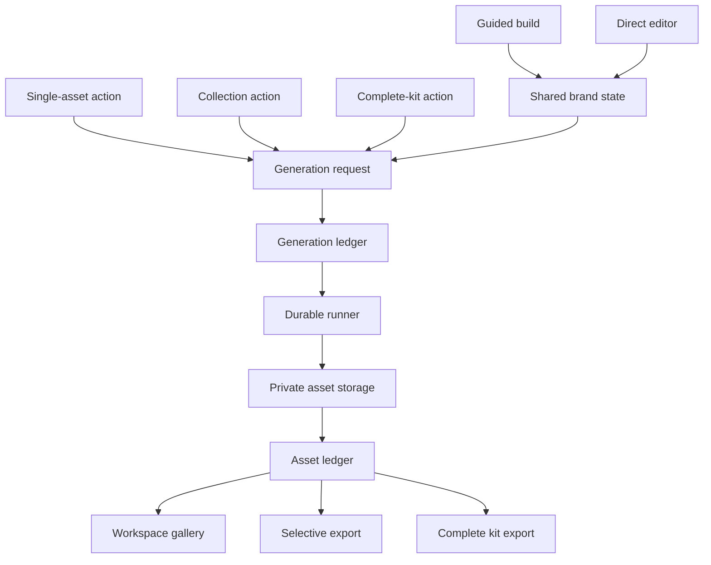
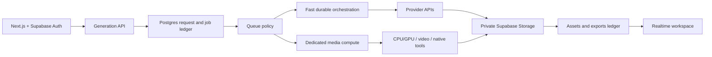

# Generation System

**Purpose:** Define the production contract for creation, rendering, export, and long-running work.

This is an architecture contract, not a run log. The current runner is Trigger.dev; the contract must remain portable.

## Product principle

Etymalia is **guided when helpful and directly controllable everywhere**.

A guided build flow gives a first-time user a confident path from brief to kit. It never replaces direct creative control. At every stage, a user may:

- start from the guided flow;
- create or regenerate one selected deliverable;
- edit the relevant inputs and tokens directly;
- retain, compare, download, or discard an individual result; or
- generate an intentional collection such as a favicon set, social set, identity set, or complete kit.

The system proposes, composes, validates, and automates. The user remains the creative director.

## Product surfaces



There is one brand state, one asset ledger, and one export contract. Guided and direct paths do not create separate sources of truth.

## Generation contracts

### 1. Request

A request is an authenticated, authorized intent to create one or more artifacts.

```ts
interface GenerationRequest {
  workspaceId: string;
  brandId: string;
  scope: "asset" | "collection" | "kit";
  requested: Array<{
    kind: string;
    variant?: string;
    lockup?: string;
    format?: string;
  }>;
  inputVersion: {
    tokenVersion: number;
    briefVersion?: number;
    referenceIds?: string[];
  };
  idempotencyKey: string;
}
```

Rules:

- Requests contain IDs, version references, and bounded options—not image bytes or secret material.
- The server authorizes workspace membership and entitlement before enqueueing.
- A request may target one asset, a named collection, or a full kit.
- Collection and full-kit actions are convenience compositions of individual asset intents; they are not a separate product capability.
- Inputs are snapshotted by version so each output has reproducible lineage.

### 2. Durable work

A runner receives a request reference, reloads authorized inputs server-side, and performs independently retryable steps.

```mermaid
sequenceDiagram
  participant U as User
  participant W as Web app
  participant D as Data ledger
  participant R as Durable runner
  participant S as Private storage

  U->>W: Generate selected asset(s)
  W->>D: Create generation request/job
  W->>R: Enqueue IDs + idempotency key
  R->>D: Mark running; load versioned inputs
  R->>R: Render one independently retryable step
  R->>S: Write immutable artifact
  R->>D: Upsert asset + lineage metadata
  R->>D: Mark completed or failed
  D-->>W: Realtime/pollable job state
  W-->>U: Preview, compare, download, export
```

Rules:

- One failure must not discard successful sibling assets.
- Retries are idempotent by request and artifact identity.
- The runner writes only to private storage and the asset ledger.
- Error records are safe, actionable, and never expose provider secrets or raw sensitive payloads.
- The UI receives job state from the ledger or the runner’s realtime facility; it never infers completion from a button click.

### 3. Asset

Every generated or uploaded artifact has a stable record:

```ts
interface BrandAsset {
  id: string;
  brandId: string;
  kind: string;
  variant: string;
  lockup: string;
  format: string;
  storagePath: string;
  inputVersion: Record<string, unknown>;
  generator: { name: string; version: string };
  dimensions?: { width: number; height: number };
  status: "ready" | "superseded" | "deleted";
}
```

The product may display a current preferred asset while retaining prior versions for comparison and rollback. Regeneration never silently destroys a user’s chosen result.

### 4. Export

An export is a deterministic selection over ready assets.

| Export mode | Meaning |
| --- | --- |
| Individual | One selected artifact in its native format. |
| Collection | A purposeful subset, such as social, identity, favicon, or stationery. |
| Custom | User-selected assets and formats. |
| Complete kit | A curated complete set with manifest and README. |

Every export is generated from the same asset ledger. The manifest records the exact artifact paths and input versions included.

## Work classes

| Class | Examples | Interaction model | Execution model |
| --- | --- | --- | --- |
| Immediate deterministic | token edit, SVG preview, name scoring | optimistic/direct | request path or short server action |
| Fast provider call | text polish, small structured analysis | stream progress/result | bounded server route with cancellation and rate limits |
| Durable asset render | PNGs, favicons, social cards, guide PDF | queued with live status | durable job, idempotent artifact steps |
| Long provider job | video, large image generation, document/video extraction | start, stream/poll state, cancel when provider supports it | durable orchestration plus provider operation polling/webhook callback |
| High-cost media compute | batch rasterization, vectorization, video transcode | queued, quota-aware, user-visible cost/state | dedicated compute worker; never a browser request |

Streaming means incremental user feedback for a live request or provider response. It does **not** mean keeping an HTTP request open while expensive render/transcode work runs. Long work is durable and reports state through the job ledger.

## Current runner: Trigger.dev

Trigger.dev currently provides the fastest integration path because task code lives with the Next.js application and offers durable async tasks, retries, queues, monitoring, realtime APIs, and self-hosting options. The deployed full-kit task is the first implementation of this contract.

### What is working

- Authenticated Trigger Cloud project and production deployment.
- Durable task source, retry policy, scoped runtime secret sync, and private Supabase artifact persistence.
- Application-level `generation_jobs` ledger and RLS read model.

### What is not yet ideal

- The accepted production verification run has remained queued, so runner execution is not production-proven.
- The current task batches all full-kit artifacts in one run. It is convenient, but it is not the final unit-of-work model.
- The UI does not yet expose durable job progress, retry, cancellation, or selective generation controls.
- The current implementation does not yet split expensive work into independently schedulable queues or account for cost/priority.

Trigger is therefore **provisionally suitable**, not permanently selected by assumption.

## Production target

The ideal shape is **hybrid orchestration, not one runner for every workload**:



### Runner selection by work, not fashion

| Need | Best-fit direction | Why |
| --- | --- | --- |
| Current web-native workflows, moderate artifact jobs | Trigger.dev Cloud | Fastest path; code-first tasks, retry/observability, existing integration. |
| Durable workflow with edge-native product surface and Cloudflare commitment | Cloudflare Workflows + Queues | Durable steps, retries, waits, lifecycle APIs; Queues offers buffering, batching, retries, DLQ, and pull consumers. |
| High-cost CPU/GPU/media work, explicit queues, regional control, auditable orchestration | AWS Step Functions Standard + SQS + ECS/Fargate or AWS Batch | Standard workflows provide auditable execution history; SQS decouples work; Fargate/Batch is appropriate for native and long compute. |
| GCP-native media/AI pipeline, Cloud Run and Vertex-first strategy | Google Workflows + Cloud Run Jobs/Services + Pub/Sub | Regional orchestration, long waits/polls, service connectors, and a natural fit for Vertex/GCP credits. |

**Recommendation:**

1. Keep Trigger for the present web-native deterministic kit only after the queue condition is resolved and one live run succeeds.
2. Do not put video, heavy vectorization, large document/video extraction, or broad batch regeneration into the same Trigger task by default.
3. Before adding high-cost media features, choose one dedicated compute lane based on the provider actually used:
   - **GCP** if Vertex and Cloud Run are the principal AI/media path.
   - **AWS** if the product needs strong queueing, Fargate/Batch, MediaConvert, and operations-grade execution control.
   - **Cloudflare** if edge delivery, Workers, R2, and Workflows become the dominant platform.
4. Keep the request, job, asset, and export contracts above unchanged so a runner migration changes adapters, not product behavior.

## Required production controls

- Per-workspace concurrency, queue, and cost budgets.
- Priority classes: interactive single asset, standard collection, background full kit, bulk regeneration.
- Idempotency keys at request, job, and artifact levels.
- Explicit cancel/supersede semantics.
- Dead-letter handling and replay tooling for failed work.
- Structured traces, metrics, alerts, and retention policy.
- Signed preview/download URLs with workspace authorization.
- Asset version lineage and user choice preservation.
- No raw user media in queue payloads, logs, or client-visible errors.

## Sources

- [Trigger.dev introduction](https://trigger.dev/docs/introduction)
- [Cloudflare Workflows](https://developers.cloudflare.com/workflows/)
- [Cloudflare Queues](https://developers.cloudflare.com/queues/)
- [AWS Step Functions overview](https://docs.aws.amazon.com/step-functions/latest/dg/welcome.html)
- [Google Cloud Workflows overview](https://cloud.google.com/workflows/docs/overview)
