# Handoff — Cloudflare Generation Foundation

**Read first:** [`CURRENT_STATUS.md`](./CURRENT_STATUS.md), [`GENERATION_SYSTEM.md`](./GENERATION_SYSTEM.md), and [`roadmap.md`](./roadmap.md).

## Mission

Build the production generation foundation for the web product:

1. migrate durable orchestration from transitional Trigger.dev tasks to **Cloudflare Workflows + Queues**;
2. preserve Supabase as the sole product system of record; and
3. complete the direct/selective generation experience around the same request, job, asset, and export contracts.

This is one coherent foundation package—not a collection of disconnected feature patches.

## Locked decisions

| Decision | Direction |
| --- | --- |
| Product interaction | Guided build is an accelerator; direct editing, selective generation, comparison, and individual/collection export are equal first-class paths. |
| Durable control plane | Cloudflare Workflows + Queues. |
| Product data and delivery | Supabase Auth, Postgres/RLS, private Storage, job/asset/export ledgers, and signed URLs remain authoritative. |
| Trigger.dev | Transitional implementation only. Do not add product features to it. Retire it from the application request path only after Cloudflare production verification succeeds. |
| Personal generation | OpenAI OAuth and xAI/Grok OAuth are the first provider integrations. Providers perform model/media work; Cloudflare orchestrates the SaaS lifecycle around it. |
| AWS | Preferred compute platform. Preserve the existing EC2/open-weight GPU runway now; Cloudflare handles current SaaS jobs. |
| GCP | Vertex media lane. Do not assume Cloud Run credit eligibility without current account-program confirmation. |
| Payloads | IDs, version references, bounded options, and idempotency keys only—never media bytes or secrets. |
| Docker | Do not use local Docker as a development or verification dependency. |

## Target architecture

```mermaid
flowchart LR
  A[Next.js application] --> B[Authenticated generation API]
  B --> C[Supabase request and job ledger]
  C --> D[Cloudflare Queue]
  D --> E[Cloudflare Workflow]
  E --> F[Step workers or dedicated compute adapter]
  F --> G[Supabase private Storage]
  G --> H[Supabase asset and export ledger]
  H --> I[Realtime or pollable workspace state]
  I --> J[Individual, collection, and complete-kit export]
```

Cloudflare controls delivery and durable execution. Supabase controls product truth. No second product database, no duplicate asset ledger, and no runner-specific product behavior.

## Work package

### A. Establish the provider and runner adapters

Create small provider and runner ports in the web application. The provider port must make OpenAI OAuth and xAI/Grok OAuth the first personal-generation adapters; the runner port must support:

- enqueueing a typed generation request;
- idempotency by request and artifact identity;
- reporting lifecycle updates to `generation_jobs`;
- cancellation/supersession hooks;
- retrieving current job state; and
- a Trigger adapter only while migration is incomplete.

Do not let pages, server actions, exports, or asset code import a runner SDK directly.

### B. Implement personal OAuth before provider-backed generation

Use the providers’ current official OAuth/API documentation at implementation time. Build OpenAI and xAI/Grok as separate adapters behind the provider port.

Required acceptance:

- authorization-code + PKCE callback flow;
- encrypted server-side token persistence, refresh, revocation, and disconnect;
- no token material in browser storage, logs, exports, or ordinary database rows;
- one verified bounded text-generation capability per provider before enabling media capability; and
- explicit reconnect behavior for revoked or expired access.

### C. Provision Cloudflare through IaC/configuration

Use the official Cloudflare tooling and current vendor documentation. Before changing account resources, inspect the existing account/project state and use the intended authenticated account.

Provision/configure:

- one queue per priority class or an equivalent explicit routing policy;
- a dead-letter route and replay procedure;
- a Workflow binding for durable orchestration;
- least-privilege secret bindings for server-to-server Supabase access;
- worker observability/logging;
- deployment configuration committed to the repository.

Do not migrate Supabase Storage to R2 in this package. Existing private Storage and its RLS model are correct product boundaries.

### D. Migrate the full-kit path

Replace the application’s Trigger enqueue call with the runner port and Cloudflare adapter.

The Cloudflare workflow must:

1. load the brand and input versions from Supabase;
2. create/update the same `generation_jobs` lifecycle record;
3. execute each artifact or bounded collection as independently retryable work;
4. persist successful artifacts immediately with lineage metadata;
5. preserve successful siblings when one item fails;
6. record safe failure state and retry eligibility; and
7. finish with a complete, observable job result.

Initial priority classes:

| Class | Examples | Priority |
| --- | --- | --- |
| Interactive | single identity or social asset | highest |
| Standard | selected identity/social/favicon collection | normal |
| Background | full kit / export rebuild | low |
| Heavy | video, vectorization, large extraction | separate adapter; not the Cloudflare default without capability validation |

### E. Complete the workspace generation UX

The workspace must expose:

- current job state: queued, running, completed, failed;
- generated artifact count and safe failure reason;
- retry/cancel where the runner/provider supports it;
- generate one selected asset;
- generate a named collection: identity, favicon, social, guide, stationery;
- create a custom selection; and
- create a complete kit as a convenience action.

The guided flow and direct controls must update the same brand/token/reference state and produce the same asset records.

### F. Reference import foundation

After the Cloudflare full-kit path is proven, add image-only reference import first:

- explicit MIME, byte-size, count, and pixel limits;
- private upload path and `brand_references` record;
- preview, deletion, retention, and extraction-job state;
- palette/extraction suggestions that require explicit user application;
- no document or video input until complete processing, preview, retention, and deletion behavior exists.

## Production acceptance gate

Do not call the migration complete until an authenticated production user can:

1. create a single asset, selected collection, and complete kit;
2. observe each durable job’s true state in the workspace;
3. see successful artifacts in private Storage and matching `assets` rows;
4. download individual assets;
5. export a selected collection and a complete kit;
6. recover a failed job without losing sibling artifacts; and
7. verify that a non-member cannot read jobs, assets, Storage objects, or exports.

## Trigger retirement gate

Only after the Cloudflare acceptance gate passes:

1. remove Trigger from application enqueue paths;
2. preserve historical Trigger artifacts and job records;
3. revoke runner-specific runtime secrets only after confirming no active runs depend on them;
4. remove Trigger dependencies/configuration in one clean change; and
5. update `CURRENT_STATUS.md`, `GENERATION_SYSTEM.md`, and `roadmap.md` together.

## Primary references

- [Generation system contract](./GENERATION_SYSTEM.md)
- [Cloudflare Workflows](https://developers.cloudflare.com/workflows/)
- [Cloudflare Queues](https://developers.cloudflare.com/queues/)
- [Current state](./CURRENT_STATUS.md)
- [Roadmap](./roadmap.md)
