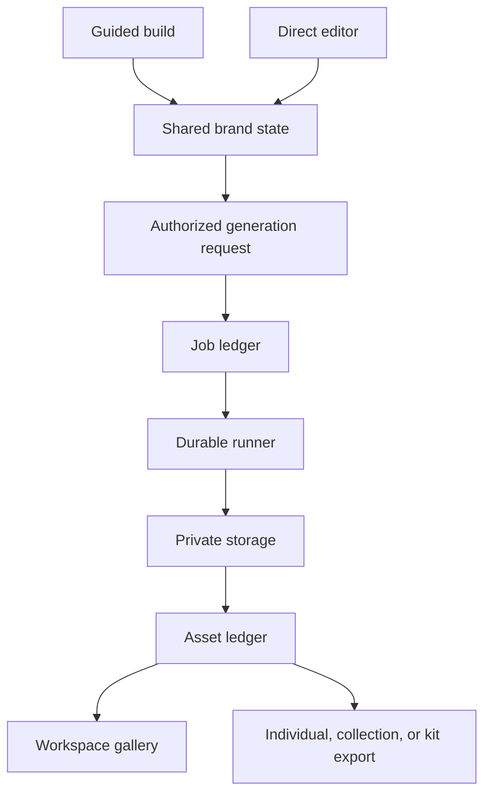

# Generation contract

## Product invariant

Guided and direct creation share one brand state, one asset ledger, and one export contract. A collection or complete kit is a convenience composition of individual artifact intents, not a separate source of truth.



## Request

A request is authenticated, authorized intent to create one or more artifacts.

```ts
interface GenerationRequest {
  workspaceId: string;
  brandId: string;
  scope: "asset" | "collection" | "kit";
  requested: Array<{
    kind: string;
    variant?: string;
    lockup?: string;
    format?: string;
  }>;
  inputVersion: {
    tokenVersion: number;
    brandUpdatedAt: string;
    briefVersion?: number;
    referenceIds?: string[];
  };
  priority: "interactive" | "standard" | "background";
  idempotencyKey: string;
}
```

Requests carry IDs, input versions, and bounded options only. They never carry raw media, browser-controlled provider/model identifiers, or secret material. The server authorizes workspace membership and entitlement before enqueueing.

## Durable work

A runner reloads versioned inputs server-side and records its lifecycle in the product ledger.

- Steps are independently retryable where feasible.
- Successful sibling artifacts remain available after a partial failure.
- Retries are idempotent by request and artifact identity.
- Errors are safe and actionable without exposing secrets or sensitive payloads.
- The UI reads actual job state from the ledger or runner integration; it never infers completion from enqueue acknowledgement.

## Assets and exports

Every generated or uploaded artifact has a stable record containing brand identity, kind, variant, format, storage path, source-version lineage, generator metadata, optional dimensions, and lifecycle status.

Regeneration does not silently destroy a user-selected result. Exports are deterministic selections over ready assets:

| Mode | Meaning |
| --- | --- |
| Individual | One native artifact. |
| Collection | A purposeful subset such as identity, favicon, social, or stationery. |
| Custom | A user-selected set of artifacts and formats. |
| Complete kit | A curated set with a manifest and README. |

The manifest records the exact artifact paths and source versions included.

## Provider boundary

Personal provider integrations expose connection state and logical capabilities (`text`, `image`, or `video`) through a provider port. Provider adapters own OAuth tokens and vendor calls; product code never selects arbitrary provider models or receives token material. A disconnected or revoked connection must require reconnection before invocation.

## Runner boundary

Trigger.dev is the current transitional implementation for full-kit work, isolated behind a runner port. Accepted requests create an authorized product-ledger job before enqueueing; the runner receives only the job ID and idempotency key, then reloads versioned inputs server-side. Cloudflare Workflows and Queues have a deployed, harmless staging control-plane foundation, but no Cloudflare-backed product runner or Supabase integration is active. The runner migration must change adapters, not the request, job, asset, or export contract.

Supabase remains authoritative for product state and private asset delivery. Heavy compute, when justified, must still honor this contract and never carry raw media through browser requests or queue payloads.

## Production controls

- Per-workspace concurrency and cost limits.
- Priority classes for interactive assets, collections, complete kits, and bulk work.
- Idempotency at request, job, and artifact levels.
- Explicit cancellation and supersession behavior.
- Observable retries, dead-letter handling, and replay.
- Signed, authorized preview/download URLs.
- Version lineage and user-choice preservation.
