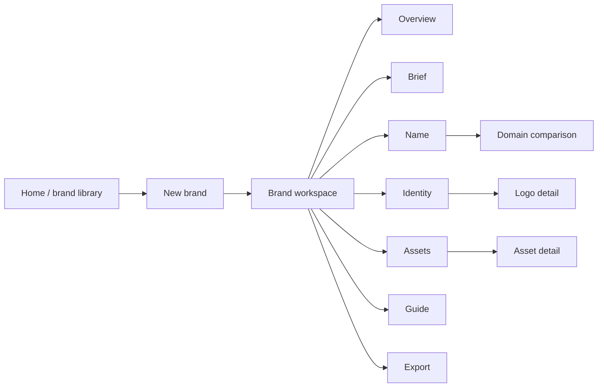

# Terra UI proposal — guided brand workspace

**Status:** planning proposal — July 14, 2026
**Scope:** Etymalia web application UX and information architecture. This is a design-direction document; it does not prescribe implementation details beyond the existing master plan.

## Executive direction

The supplied sketches have the right core idea: a focused application shell, a visual working area, and dedicated places to create names, check domains, build logos, generate assets, and maintain a brand guide.

My recommendation is to retain that structure, but change the *primary experience* from a sequence of separate tools into a **single brand workspace with a guided build path**. Every stage remains independently editable, but the default user never has to decide where to go next.

The product should make both promises true:

1. **Quick path:** “Here is a reference image and a short description. Make me a credible first brand system.”
2. **Directed path:** “I want to evaluate root provenance, choose a name, tune a palette, select one mark, and generate only the assets I need.”

The system should always show what is selected, what is provisional, and what a change will regenerate.

---

## What I understood from the supplied sketches

| Supplied concept | Intent preserved | Recommendation |
| --- | --- | --- |
| Persistent left rail with six tools | Stable orientation and a professional-tool feel | Keep it, but make it the **brand workspace navigation**, not a mandatory linear workflow. Include an Overview entry and use text labels on desktop. |
| Name generator with saved words / concepts / groups and visual or table results | Iterative naming and structured exploration | Consolidate into a candidate workspace with list/grid toggle, filters, provenance drawer, and a persistent shortlist. Avoid a separate “groups” mental model unless research proves it is necessary. |
| Domain checker with selectable names and results table | Evaluate chosen names before committing | Make domain status a layer on every candidate; open a dedicated comparison view only when the user is ready to decide. Ship RDAP domains first; label future social checks as unavailable or best-effort rather than implying certainty. |
| Logo creation with guide, config, prompt, and canvas | Directable generation and iterative selection | Make the prompt/config an expandable **generation drawer**. Keep the canvas visual-first and reserve the drawer for the manual path. |
| Asset generation gallery | Asset previews and selective creation | Use a catalog of deliverable families with “Generate” and “Regenerate” actions. The user should not need to understand every asset before seeing useful examples. |
| Brand guide with token controls and applied examples | A living source of truth | Treat this as the token editor and quality-control center, not a final static page. A token edit should show impact and require explicit regeneration for stored raster/PDF assets. |
| Profile split between organization and brand | Workspace and brand metadata | Split these explicitly: **Workspace settings** belongs outside the brand flow; **Brand brief** is the first workspace stage. |

### Keep from the visual language

- Dense-but-calm desktop canvas with a persistent rail.
- A distinct accent color for the current stage and primary action.
- Gallery cards as the natural view for visual output.
- A contextual side panel when a stage needs focused controls.

### Change before implementation

- Do not put all workflow controls permanently in a second narrow sidebar. It starves the creative canvas and hides essential actions.
- Do not make “Generate” the only primary action. The primary action should reflect the state: **Start a brand**, **Generate 12 names**, **Choose this name**, **Create concepts**, **Generate selected assets**, or **Export kit**.
- Do not separate domain checking from the name result itself. Availability is a ranking signal and must be visible at candidate-selection time.
- Do not make users fill a long profile form before they can see value. Capture only enough brief data to produce a first result; progressively disclose the rest.

---

## Proposed information architecture

### Global navigation

| Area | Purpose |
| --- | --- |
| **Brand library** | Existing brands, new brand, recently exported kits. |
| **Brand workspace** | The current brand only. Top bar shows brand name, last save, job status, Share/Export. |
| **Workspace settings** | Organization/team, plan, provider connections/BYOK, account. Kept out of creative work. |

### Brand workspace navigation

1. **Overview** — health/status, next recommended action, selected name/identity, recent outputs.
2. **Brief** — business description, audience, tone, keywords, references, optional constraints.
3. **Name** — Etymaria candidates, provenance, shortlist, domain comparison.
4. **Identity** — selected name, logo concepts, palette, typography, mark variants.
5. **Assets** — favicon, social, stationery, video, and other output families.
6. **Guide** — editable tokens and living guideline preview.
7. **Export** — package scope, validation, generated ZIP history.

This follows the supplied sections while adding Overview, Brief, and Export as first-class outcomes. The latter matters because the master plan correctly defines the ZIP package as the product.

---

## The two entry paths

### A. Quick build (default)

**Entry:** `New brand` → one-page Quick Build form.

Required inputs:

- What are you creating? (one sentence)
- 3–5 keywords or desired associations
- One optional reference image

Helpful optional inputs, collapsed by default:

- Existing name (if they are not naming)
- Industry and audience
- Desired tone (3–5 selectable chips)
- Geographic/language constraint
- “Avoid” terms or styles

Primary action: **Create my first direction**.

This starts an orchestrated job that creates a *draft*, not an irreversible brand:

1. Extract reference color/vibe information if present.
2. Create 12 ranked name candidates with provenance.
3. Check primary domains asynchronously and surface state as it returns.
4. Propose a contrast-safe palette and type direction.
5. Generate 3 logo directions only after a name has been selected—or generate neutral concept directions marked as provisional if “automatic logo” is explicitly enabled.
6. Present a **Review your direction** screen with a concise decision list.

The one deliberate pause is name selection. A logo system should not be treated as final until its name is chosen. For a true one-click experience, Etymalia may select its highest-scoring candidate automatically, but the UI must clearly say “draft name” and make changing it easy.

### B. Directed build (manual)

**Entry:** `New brand` → `Build step by step`.

The user is placed in Brief with all controls available. They can visit any stage, generate only one component, and return later. Recommended next steps appear on Overview and as non-blocking status chips—not as a modal wizard.

### C. Returning to either path

Quick Build and Directed Build must converge on the same `brands/{brandId}` workspace and the same underlying brief/tokens/assets. There must be no “quick project” type with a different data model.

---

## Core interaction model

### 1. Workspace layout

- **Left rail:** brand navigation; icons plus labels at desktop widths, icon-only collapsed state, a mobile drawer below desktop breakpoint.
- **Top bar:** breadcrumb/library, editable brand name, autosave state, job progress indicator, `Export` button.
- **Main canvas:** stage-specific work. Visual material gets the largest area.
- **Context drawer:** right-side drawer on wide screens; bottom sheet on narrower screens. Used for prompt/configuration, filters, inspector detail, and generation settings. Closed by default for the quick path.
- **Action bar:** stage-specific primary action; remains visible when long pages scroll.

The main difference from the supplied sketches is that the controls drawer is elastic—not permanently consuming canvas width.

### 2. Draft, selected, and generated states

Every substantial item needs an explicit state label:

| State | Meaning | Example action |
| --- | --- | --- |
| Draft | AI or user proposal, not yet adopted | `Compare`, `Refine`, `Discard` |
| Selected | The brand’s current source-of-truth choice | `Change`, `Lock` |
| Generated | A derived file based on current source data | `Download`, `Regenerate` |
| Out of date | A source token/name/mark changed after generation | `Review changes`, `Regenerate` |
| In progress / failed | Durable background job state | `View progress`, `Retry` |

This is critical for the deterministic-pipeline principle in the master plan. A token edit must never silently claim all stored derivatives are updated.

### 3. Generation controls

Use three levels, rather than placing raw prompt text first:

1. **Direction chips:** concise, understandable levers such as `editorial`, `geometric`, `warm`, `high contrast`, `quiet luxury`.
2. **Advanced controls:** color locks, type category, logo lockup, asset template, reference emphasis.
3. **Prompt disclosure:** editable AI instruction text, with a reset-to-generated-default action and a note that it affects only the next run.

This preserves expert control without asking new users to prompt-engineer their way through the product.

### 4. Jobs and progress

Generation is asynchronous. The UI should use a compact global job indicator plus an in-context progress card showing:

- current pipeline stage;
- completed / queued / failed items;
- what can still be edited safely;
- cancel or retry where supported;
- a non-blocking “continue working” option.

Never lock the entire application behind a spinner.

---

## Stage designs

### Overview — the missing hub

Overview is the default landing location after creation and after a user returns to a brand. It answers four questions without making the user hunt:

- What is this brand?
- What is currently selected?
- What is ready and what needs attention?
- What is the next best action?

Suggested sections: brand snapshot, progress/health checklist, selected name and domain status, selected identity card, recent assets, and a single contextual call-to-action.

### Brief — intake without a wall of fields

Organize a short always-visible brief and expandable detail sections:

- **Core:** description, industry, audience, goals.
- **Direction:** tone sliders/chips, keywords, avoid list.
- **References:** image/document/video upload, reference extraction findings, source/retention note.
- **Constraints:** name length, language, existing name, palette/typography preferences.

When a reference is uploaded, show the extracted palette and vibe as *suggestions*, each with accept/remove controls. Do not present model analysis as an objective fact.

### Name — Etymaria’s signature experience

The default candidate card should include: name, phonetic cue, concise meaning, source roots/provenance, length/syllables, quality score explanation, and domain status.

- Use a **three-column card grid** for discovery and a **table** for comparison; preserve the supplied view-toggle idea.
- Persistent shortlist tray: users can compare 2–6 candidates without “saving” into an ambiguous second collection.
- Candidate detail opens in a drawer: etymology lineage, blend rationale, pronunciation, alternatives, and flags.
- Domain checks begin automatically for visible/shortlisted candidates, with per-TLD results in the comparison view.
- Do not promise social availability in MVP. If added later, label its confidence/source and timestamp.

### Identity — name, mark, palette, and type in one system

The supplied Logo Creation and Brand Guide screens should be connected, not separate silos:

- **Identity canvas:** selected logo direction and representative applied previews.
- **Tabs/segments:** Logo, Color, Type, Voice.
- **Concept rail:** alternatives and version history.
- **Token inspector:** values, contrast status, lock/unlock behavior.
- **Applied preview strip:** web header, social avatar, business card, favicon—real contexts instead of abstract boxes.

A color/type change updates live CSS/SVG previews immediately. It marks deterministic derivatives as out of date and offers scoped regeneration.

### Assets — catalog, not an empty grid

Represent deliverables as named families with value and status:

- Essentials: logo files, favicon package, basic social avatar/OG image.
- Social: platform profiles, covers, posts.
- Documents: guideline PDF, letterhead, email signature, business card.
- Motion: video promo (clearly premium/long-running).

Each card shows a meaningful preview, template selection, source version, status, and its output formats. Users can select a sensible preset (`Launch essentials`, `Social starter`, `Full kit`) or choose individual families.

### Guide — editable source of truth plus rendered evidence

Use split view: token/source editing on one side and an actual guideline preview on the other. Guide sections mirror the master plan: logo usage, color specifications, typography, voice, imagery, and examples. “Export guide PDF” is a generated derivative with a version/time stamp.

### Export — a release checklist, not a download button

Show selected package contents, file format coverage, stale/missing validation, and folder preview before generating. Suggested blockers:

- no selected name or primary logo;
- inaccessible required color pairing;
- missing mandatory favicon source;
- stale derivatives included in package.

Allow an intentional partial export with a clear warning, rather than silently omitting files.

---

## Proposed wireframes

The accompanying SVGs are intentionally low-fidelity. They communicate hierarchy and behavior—not final visual styling.

| File | Shows |
| --- | --- |
| [`01-quick-build.svg`](./01-quick-build.svg) | Fast reference + prompt intake and the generated-direction review state. |
| [`02-brand-workspace.svg`](./02-brand-workspace.svg) | Consolidated workspace shell, identity canvas, contextual drawer, and token-driven applied previews. |
| [`03-name-and-export.svg`](./03-name-and-export.svg) | Etymaria candidate selection/domain comparison and a package-validation export flow. |

---

## Responsive behavior

The supplied sketches are desktop-first, which fits the professional workbench. Mobile should support review, selection, lightweight edits, and download—not shrink the desktop tool unchanged.

| Breakpoint | Behavior |
| --- | --- |
| Desktop (≥ 1200px) | Persistent labeled rail, main canvas, optional right drawer. |
| Tablet (768–1199px) | Narrow/icon rail; context drawer opens as overlay; cards reduce to two columns. |
| Mobile (< 768px) | Top app bar + navigation drawer; one-column canvas; context uses bottom sheet; candidate shortlist is sticky. Heavy logo/asset comparison can remain optimized for larger screens but must stay usable. |

Keyboard essentials: `Cmd/Ctrl+K` for commands/search, `G then N/I/A` to navigate stages, arrow keys to move among candidate/asset cards, and clear focus treatment for all generated-content actions.

---

## Accessibility and trust requirements

- Do not communicate state by the purple accent alone; include text/status icon and accessible contrast.
- Every generated image needs an accessible name based on its role/version.
- Explain scores and availability data in plain language, with timestamp/source where useful.
- Reference uploads can be sensitive. Before upload, explain analysis purpose, retention, and delete control; support hard delete per the master plan.
- Preserve user edits to prompts, labels, and tokens across generation failures/retries.
- Offer `Undo` for local selection/edit changes; never make “Regenerate” destroy a prior output. Keep version history.

---

## MVP sequencing aligned to the existing roadmap

This design intentionally avoids designing Phase 3/4 complexity as required MVP work.

| Phase | User-visible slice |
| --- | --- |
| Phase 0 | Brand library, auth/provider settings, empty workspace shell, data-safe status patterns. |
| Phase 1 | Brief → Name + RDAP → palette → single logo direction → deterministic variants/favicons → validated ZIP export. This is the first end-to-end “Launch essentials” flow. |
| Phase 2 | Reference extraction, richer identity/guide editor, social kit catalog, durable job progress. |
| Phase 3 | Stationery/motion templates, billing/entitlements, provider choice, social/SEO signals after ToS validation. |
| Phase 4 | Collaboration, audit loop, advanced templates and API. |

---

## Decisions to settle before UI implementation

1. **Quick-build logo behavior:** Should automatic mode stop for name selection (recommended), or may it create a clearly labelled provisional logo from the top-ranked name?
2. **Commitment model:** Is a selected name immediately the brand name, or should users explicitly `Lock name` before identity generation? Recommended: selected-by-default, lock optional before export.
3. **Reference limits and retention:** supported types/sizes, visibility, auto-deletion policy, and whether video analysis is Phase 2 only.
4. **Asset presets for MVP:** recommended initial presets are `Launch essentials` and `Full kit`; confirm whether a social starter is needed at launch.
5. **First brand template styles:** choose 3–5 named starting directions to make quick builds more predictable and reduce prompt dependence.
6. **Collaboration scope:** Phase 1 is single-user. Confirm whether share links/review comments are expected before Phase 4.

---

## Recommended next planning artifact

Before laying application code, turn this proposal into a small **screen-and-state inventory** for Phase 1: route, data required, empty/loading/error/complete states, mutation/job triggered, and acceptance criteria. That will give implementation a bounded first vertical slice without prematurely freezing the visual system.
